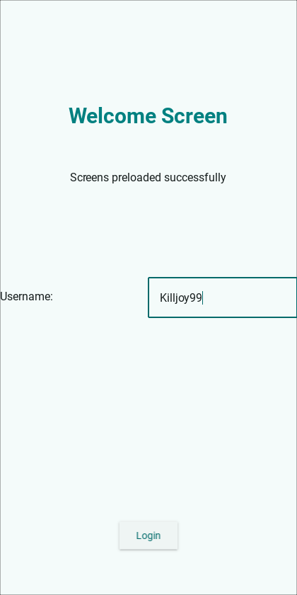
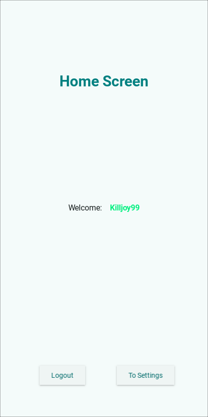
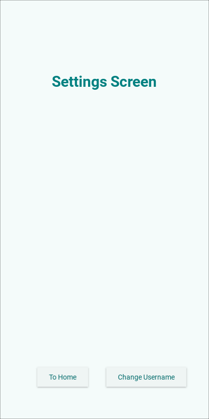

# Kivy - KivyMD Lazy Loading Template


Supercharge the performance of your Kivy - KivyMD app 🚀 with lazy loading.

By implementing this template, you can supercharge the performance of your Kivy app through the technique of lazy loading screens.
Rather than loading all the screens at startup, this approach ensures that screens are loaded only when they are actively switched to or preloaded on request.
It is best to preload by scheduling the preload Clock.schedule_once(method)
As a result, the startup time of your app can be significantly reduced and screen transitions feel more smooth.

This template also features a **`screen navigation system`** that simplifies handling the back button.

## `Requirements`

`Kivy>=2.3.0"`
`KivyMD==2.0.1.dev0`

## 🗺️ `Navigation`

The [`Root`](https://github.com/kulothunganug/kivy-lazy-loading-template/blob/main/libs/uix/root.py) is based on [`screen`](https://kivy.org/doc/stable/api-kivy.uix.screen.html) and additionally provides a few navigation methods: `push(screen_name, side, transition_type)`, `push_replacement(screen_name, side, transition_type)` and `back()`.

Also `load_screen(screen_name, preload=True)` method can be used to load the screen and the kv file without setting it as the current screen.

To incorporate additional screens into your app, follow these steps:

1. Create `screen_file.py` in the `libs/uix/screens/` directory.
2. Create `screen_file.kv` in the `libs/uix/kv/screens/` directory.
3. Add the screen details to `screens.json` as shown below:

```json
{
    ...,
    "welcome": {
        "module": "libs.uix.baseclass.screens.welcome",
        "class": "WelcomeScreen",
        "kv": "libs/uix/kv/screens/welcome.kv"
    },
}
```

This template already contains three screens as example which uses all the crucial navigation methods.

## 🔙 `Special Back Functionality`

The back method in this template adds a two-second delay before exiting the application if there are no other screens to navigate back to and the back button has been pressed twice (`Non android uses escape`). This simulates the double-click behavior commonly found on Android devices for exiting apps, enhancing the user experience by preventing accidental exits.

## 📸 `Screenshots`

Here are some screenshots of the app in action.

<p align="center">
    
    
    
</p>

## 📱 `Building for Mobile with Buildozer`

To use this template for mobile devices, ensure that JSON files are included in your buildozer.spec configuration. Update the source.include_exts section as follows:

```spec
# (list) Source files to include (let empty to include all the files)
source.include_exts = py,png,jpg,kv,atlas,gif,json
```

This ensures that all necessary file types, including JSON, are packaged with your app, preventing potential runtime errors related to missing resources.

## 🛠️ `Implementation Example`

Below is a simplified example to illustrate how you can implement lazy loading and navigation using this template.

main.py

```py
from kivymd.app import MDApp
from libs.uix.root import Root

class MyApp(MDApp):
    def build(self):
        self.root = Root()
        return self.root

    def on_start(self):
        # Preload the welcome screen after startup
        self.root.preload_screens(["welcome"])

if __name__ == '__main__':
    MyApp().run()
```

```py
import logging

from kivy.clock import Clock
from kivy.properties import StringProperty
from kivymd.uix.screen import MDScreen

logger = logging.getLogger(__name__)


class WelcomeScreen(MDScreen):
    status = StringProperty("")

    def on_enter(self):
        """Called when entering the screen. Preloads potential next screens."""
        # Preload the next likely screen (optional) to reduce load times and help in transitioning smoothly
        Clock.schedule_once(self.preload_next)

    def preload_next(self, dt) -> None:
        """Preload the home Screen"""
        self.manager.preload_screens(["settings"])
        self.status = "Screens preloaded successfully"

    def login(self, new_name: str) -> None:
        """Change the user's name and store it in shared data."""
        logger.info(f"Changing name to: {new_name}")
        self.manager.set_shared_data("username", new_name)
        self.manager.push_replacement("home")

    def on_leave(self):
        """Called when leaving the screen. Removes this screen from cache."""
        # Remove this screen from the cache as it will never be needed anymore (reducing memory usage)
        self.manager.remove_screen_from_cache(self.name)

```

## 📚 Additional Resources

- [Kivy Documentation](https://kivy.org/doc/stable/)
- [KivyMD Documentation](https://kivymd.readthedocs.io/en/latest/)
- [Buildozer Documentation](https://buildozer.readthedocs.io/en/latest/)

## 🚀 `Getting Started`

### Clone the Repository

Clone this template repository to your local machine.

```bash
git clone https://github.com/Killjoy99/kivymd-lazy-loading-template.git
cd kivy-lazy-loading-template
```

### Install Dependencies

Install the required dependencies using pip.

```bash
pip install -r requirements.txt
```

### Run the App

Execute the main application to see the lazy loading in action.

```bash
python main.py
```

### Customize Your App

Add your own screens by following the steps outlined in the Navigation section.

## 💡 `Tips for Optimizing Performance`

### Preload Critical Screens

Use Clock.schedule_once to preload screens that are essential for the user experience, ensuring they load quickly when needed.

### Lazy Load Heavy Resources

Delay the loading of heavy resources (e.g., images, data) until they are absolutely necessary to reduce initial load times.

### Optimize Screen Transitions

Choose appropriate transition types and directions to make screen switches feel natural and responsive.

### Manage Screen History Efficiently

Keep track of screen navigation history to provide intuitive back navigation without consuming excessive memory.

### Producer / Consumer

Use this with the producer consumer taking into effect the fps of the device and adjusting the consumption of items based on that to avoid overloading devices with lower memory while taking advantage of the devices with larger memory.

## 🛠️ `Contributing`

Contributions are welcome! If you find any issues or have suggestions for improvements, please open an issue or submit a pull request on the GitHub repository.

## 📄 `License`


Licensed under the MIT License. See the [LICENSE](./LICENSE) file for more information.
